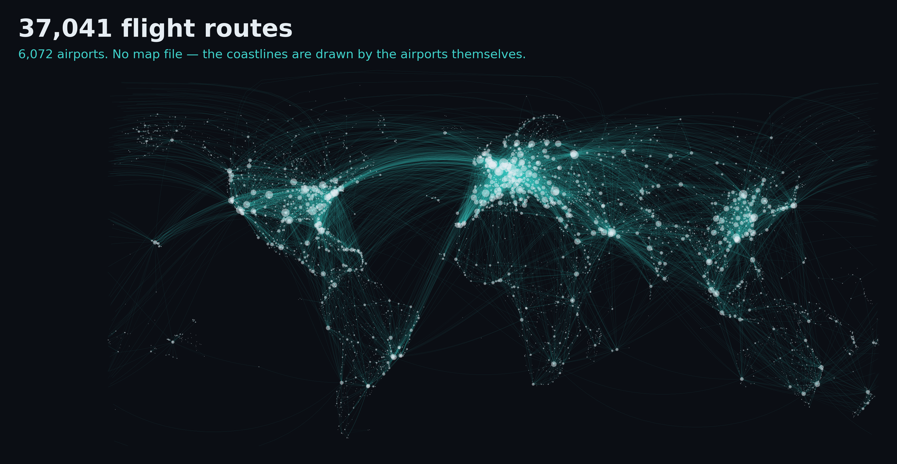
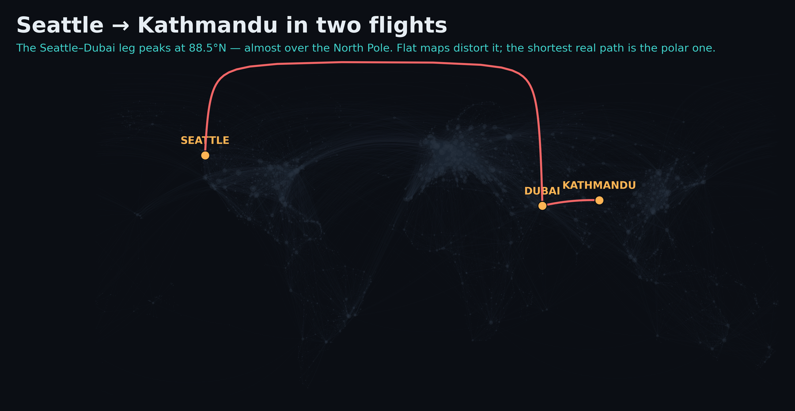
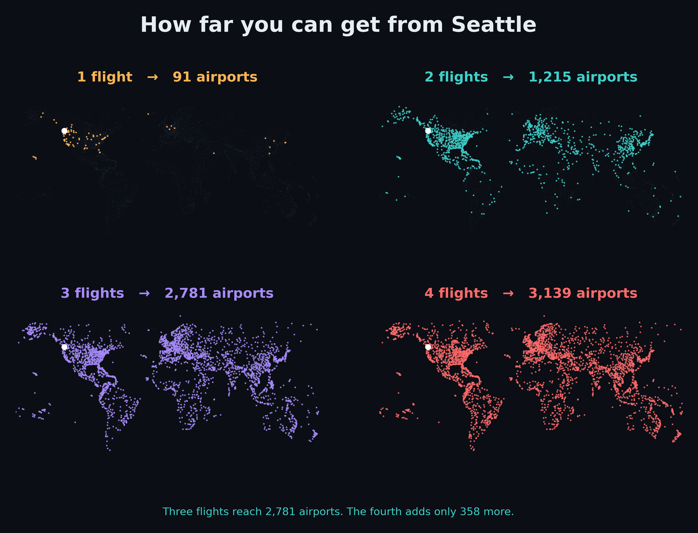
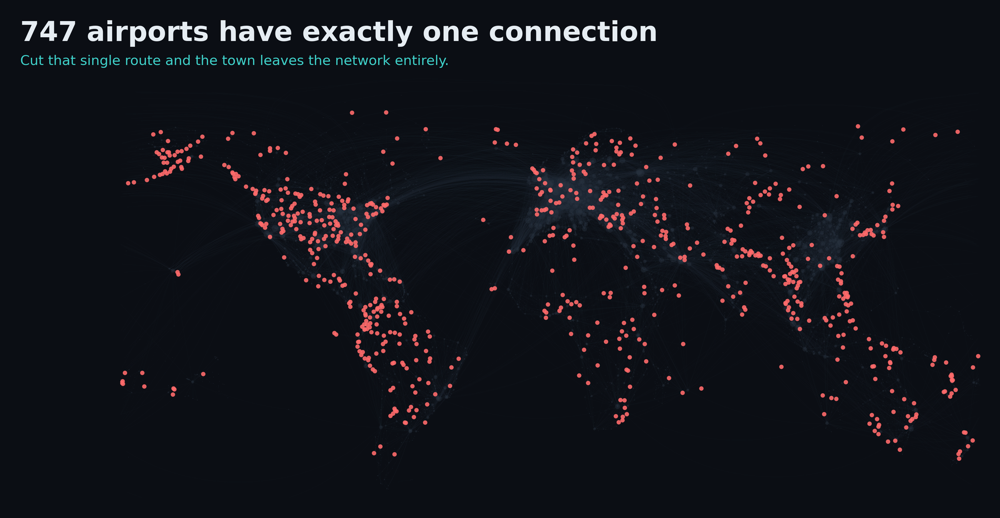

# Global Airline Route Network Demo



## Prerequisites:
- Docker
- Docker Compose
- Python 3

## Summary

This Global Airline Route Network Demo models the world's scheduled flight network as a graph to answer routing and resilience questions that are difficult to express in SQL.
Using 6,072 airports and 37,041 nonstop connections, we find multi-leg itineraries between airports with no direct service, rank the hubs the network actually depends on, and identify the airports most at risk of losing all connectivity.
Because the number of flights in a route is unknown before you ask, these questions require variable-depth traversal — the exact operation relational queries handle badly and graph queries handle natively.
We show that the network has effectively no single point of failure among its mega-hubs, while 747 small airports depend on exactly one route, inverting the usual intuition about where infrastructure risk lives.
All data stays in PostgreSQL. PuppyGraph queries it as a graph directly. No ETL or data duplication required.

- **`README.md`**: Overview of the project, setup instructions, and the query walkthrough.
- **`docker-compose.yaml`**: Starts PostgreSQL and PuppyGraph, wired together on one network.
- **`init/01_load_data.sql`**: Runs automatically on the database's first start. Creates the five tables, loads the CSVs, and declares the foreign keys.
- **`csv_data/`**: The five source tables as CSV. Derived from [OpenFlights](https://github.com/jpatokal/openflights), licensed under the [Open Database License (ODbL)](https://opendatacommons.org/licenses/odbl/). Modifications have been made to the original dataset: routes with stops were removed, per-airline duplicates were collapsed to one row per airport pair, and great-circle distances were computed from coordinates.
- **`schema.json`**: The graph model. Maps the five tables to 3 node types and 4 edge types.
- **`validate.py`**: Pre-flight check. Confirms the SQL, the CSVs, and `schema.json` agree before any containers start.
- **`route_analysis.py`**: Connects to PuppyGraph over Bolt and runs the analyses from the command line.
- **`img/`**: Figures generated from the data.
- **`docs/`**: Extended setup notes, the video production guide, and the screenshot checklist.

## Deployment

- Optional but recommended — confirm the data, SQL, and schema agree before starting any containers:
```bash
pip install duckdb
python3 validate.py
```
Example output:
```bash
ALL CHECKS PASSED — safe to run: docker compose up -d
```

- Run the following command to start PostgreSQL and PuppyGraph:
```bash
sudo docker compose up -d
```
Example output:
```bash
[+] Running 3/3
✔ Network puppy-airline    Created
✔ Container postgres       Healthy
✔ Container puppygraph     Started
```

## Data Preparation

The data loads automatically the first time the PostgreSQL container starts. `init/01_load_data.sql` is mounted into `/docker-entrypoint-initdb.d/`, which Postgres executes on initialization, so there is no manual import step.

- Confirm the load by opening a psql shell:
```bash
sudo docker exec -it postgres psql -U postgres -d flightdb
```

- Run the following to verify the tables:
```sql
SELECT 'airports' AS table, count(*) FROM air.airports
UNION ALL SELECT 'airlines',         count(*) FROM air.airlines
UNION ALL SELECT 'countries',        count(*) FROM air.countries
UNION ALL SELECT 'flight_routes',    count(*) FROM air.flight_routes
UNION ALL SELECT 'airline_airports', count(*) FROM air.airline_airports;
```
Expected output:
```
      table       | count
------------------+-------
 airports         |  6072
 airlines         |  6161
 countries        |   315
 flight_routes    | 37041
 airline_airports | 19011
```

- Inspect a few rows of the route table:
```sql
SELECT * FROM air.flight_routes WHERE src_iata = 'SEA' LIMIT 5;
```

These are five ordinary relational tables with primary and foreign keys. Nothing about them is graph-shaped, and there is no table of multi-leg itineraries anywhere. The graph is created entirely by `schema.json` in the next step, and no data is copied to build it.

- Exit psql:
```sql
\q
```

## Modeling the Graph

- Log into PuppyGraph Web UI at http://localhost:8081 with username `puppygraph` and password `puppygraph123`.

<!-- SCREENSHOT: the PuppyGraph login page -->
<!--  -->

- Upload the schema by selecting the file `schema.json` in the Upload Graph Schema JSON block and clicking on Upload.

<!-- SCREENSHOT: the Upload Graph Schema JSON block with schema.json selected -->
<!--  -->

- Once the graph is created, the schema page displays the visualized graph schema.

<!-- SCREENSHOT: the rendered schema page -->
<!--  -->

The schema maps:

| Node | Source table | Count |
|---|---|---:|
| `Airport` | `air.airports` | 6,072 |
| `Country` | `air.countries` | 315 |
| `Airline` | `air.airlines` | 6,161 |

| Edge | From → To | Source table | Count |
|---|---|---|---:|
| `FLIES_TO` | Airport → Airport | `air.flight_routes` | 37,041 |
| `LOCATED_IN` | Airport → Country | `air.airports` | 6,072 |
| `SERVES` | Airline → Airport | `air.airline_airports` | 19,011 |
| `BASED_IN` | Airline → Country | `air.airlines` | 6,161 |

`LOCATED_IN` and `BASED_IN` have no table of their own. They come from `air.airports` and `air.airlines` — the same rows that are already the `Airport` and `Airline` nodes, read a second time as edges. Nothing is duplicated.

## Querying the Graph by Web

- Click on the Query panel on the left side. The Gremlin Console and Cypher Console tabs offer an interactive environment for querying the graph.

**Note:** PuppyGraph returns node and edge structure without property values unless asked. Queries that need properties begin with `USING enableCypherEngineProperties 'true'`.

1. Query every nonstop destination from Seattle
```gremlin
g.V().hasLabel('Airport').has('iata','SEA').out('FLIES_TO')
```
Returns 90 airports radiating from a single hub. Try the Radial and Force layouts.

<!-- SCREENSHOT: the 90-node radial graph -->
<!--  -->

2. Query a single airport, then expand it
```gremlin
g.V().hasLabel('Airport').has('iata','KTM')
```
Right-click the returned node and select **Expand with all Edge Labels** to traverse outward, revealing the airports Kathmandu connects to, the country it is in, and the airlines serving it.

<!-- SCREENSHOT: KTM after expansion -->
<!--  -->

3. Query two-flight routes from Seattle to Kathmandu
```gremlin
g.V().hasLabel('Airport').has('iata','SEA').out('FLIES_TO').out('FLIES_TO').has('iata','KTM').path()
```
Returns two paths: via Dubai (DXB) and via Seoul Incheon (ICN).

4. Find the shortest route between two airports with no direct service
```cypher
USING enableCypherEngineProperties 'true'
MATCH (a:Airport {iata: 'SEA'}), (b:Airport {iata: 'KTM'}),
      path = shortestPath((a)-[:FLIES_TO*..6]->(b))
RETURN [n IN nodes(path) | n.city + ' (' + n.iata + ')'] AS route,
       length(path) AS flights
```
Nepal has no direct flights from North America. The answer is 2 flights, via Dubai.



Change `KTM` to `USH` for Ushuaia, Argentina — the southernmost city in the world — and the same query returns 3 flights, via Dallas and Buenos Aires. Only the destination code changes.

5. Measure how much of the world becomes reachable with each additional flight
```cypher
MATCH (sea:Airport {iata: 'SEA'})-[:FLIES_TO*1..2]->(d:Airport)
RETURN count(DISTINCT d) AS reachable
```
Change `*1..2` to `*1..3` and `*1..4` and re-run. Only the number changes.

| Flights | Airports reachable |
|---:|---:|
| 1 | 91 |
| 2 | 1,215 |
| 3 | 2,781 |
| 4 | 3,139 |



6. Rank hubs by raw connection count
```cypher
USING enableCypherEngineProperties 'true'
MATCH (a:Airport)-[f:FLIES_TO]-()
RETURN a.iata, a.city, count(f) AS connections
ORDER BY connections DESC LIMIT 15
```
Frankfurt leads with 477 connections.

7. Rank hubs by PageRank — a different question, and a different answer
```cypher
CALL algo.paral.pagerank({
    labels: ['Airport'],
    relationshipTypes: ['FLIES_TO'],
    maxIterations: 40,
    dampingFactor: 0.85
}) YIELD id, score
RETURN id, score ORDER BY score DESC LIMIT 15
```
Atlanta ranks first and Frankfurt drops to eighth. Denver is fourteenth by connection count but fourth by PageRank. Connection count measures destinations served; PageRank measures how much travel routes through an airport. The US domestic network is the densest cluster in the data, so traffic recirculates within it.

8. Find the airports a single cancelled route would isolate
```cypher
USING enableCypherEngineProperties 'true'
MATCH (a:Airport)-[:FLIES_TO]-(other:Airport)
WITH a, count(DISTINCT other) AS links
WHERE links = 1
RETURN a.iata, a.city, a.country_id
ORDER BY a.country_id LIMIT 30
```



9. Detect regional structure with community detection
```cypher
CALL algo.louvain({
    labels: ['Airport'],
    relationshipTypes: ['FLIES_TO'],
    maxIterations: 30,
    maxLevels: 1,
    seed: 42
}) YIELD id, communityId
RETURN communityId, count(*) AS size ORDER BY size DESC LIMIT 15
```
Switch the result panel to the Graph view. Nothing tells the algorithm about geography; the clusters it finds correspond to continents and regional blocs.

## Querying the Graph by Code

- Use the script `route_analysis.py` to connect to PuppyGraph over Bolt and run the analyses from the command line:
```bash
pip install neo4j
python3 route_analysis.py
```
- Any origin and destination pair works:
```bash
python3 route_analysis.py --origin LAX --destination TBU
```

## Key Findings

| Question | Result |
|---|---|
| Seattle → Kathmandu | **2 flights**, via Dubai |
| Seattle → Ushuaia, Argentina | 3 flights, via Dallas and Buenos Aires |
| Airports reachable in 1 / 2 / 3 flights | 91 / 1,215 / 2,781 |
| Busiest airport by connections | Frankfurt, 477 |
| Most central airport by PageRank | Atlanta — Frankfurt drops to 8th |
| Airports orphaned if Frankfurt closes | **1** |
| Airports orphaned if Atlanta closes | 9 |
| Airports with exactly one connection | **747** |

The last three rows are the point of the demo. Removing the world's most-connected airport disconnects one other airport, because every mega-hub has an alternative. The real fragility is at the periphery, where 747 airports depend on a single route.

## Notes and Limitations

- **The route data is a historic snapshot**, roughly 2014-era. It is well suited to demonstrating network structure and unsuitable for planning actual travel.
- **2,815 airports have no route data.** OpenFlights lists many small airfields with no scheduled service. Of the 3,257 airports that do have routes, 3,231 — 99% — form a single connected network.
- **Codeshares are collapsed.** The same physical flight sold by several airlines is one connection; the carrier list is kept in the `airlines` property.
- **`distance_km` is great-circle distance**, computed from coordinates. Actual flown distance is somewhat longer because aircraft follow air corridors.
- **"One connection" means one distinct neighbour**, not one route row. 38 airports have a one-way flight in from one airport and out to another, giving them two route rows but two neighbours.

## Cleanup and Teardown

- To stop and remove the containers, networks, and volumes, run:
```bash
sudo docker compose down --volumes --remove-orphans
```

Note that `--volumes` deletes the database. On the next `docker compose up -d`, the init script runs again and reloads the data from scratch.

## License

Code in this demo is released under the Apache License 2.0.

Data is derived from [OpenFlights](https://openflights.org) and is licensed under the [Open Database License (ODbL)](https://opendatacommons.org/licenses/odbl/). Attribution is a condition of that licence — please credit OpenFlights if you reuse it.
